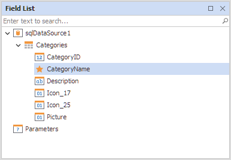

# Reporting for WinForms -  Custom Icons for the Field List Items in the End-User Designer

This example shows how to replace initial images with custom images for the [Field List](https://github.com/DevExpress/dotnet-eud/blob/0bd25afd4661519ae541debf649e650043c5e435/interface-elements-for-desktop/articles/report-designer/report-designer-for-winforms/report-designer-tools/ui-panels/field-list.md) items.

## Files to Review

* [CustomFieldListService.cs](./CS/CustomFieldListService.cs) (VB: [CustomFieldListService.vb](./VB/CustomFieldListService.vb))
* [Form1.cs](./CS/Form1.cs) (VB: [Form1.vb](./VB/Form1.vb))

## Documentation

- [Use Custom Icons for the Field List Items](https://docs.devexpress.com/XtraReports/9401/winforms-reporting/end-user-report-designer-for-winforms/api-and-customization/provide-custom-icons-to-the-field-list-items)

## More Examples

- [Reporting for WinForms - Custom Names for the Field List Data Items](https://github.com/DevExpress-Examples/Reporting_how-to-provide-custom-names-for-the-field-list-data-items-e459)

